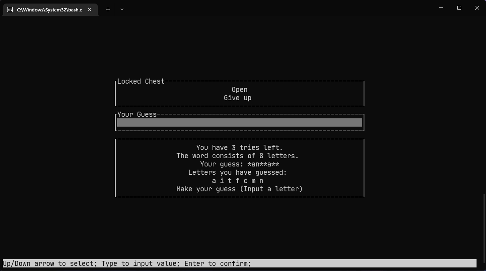

# engg1340-game-project

A repository for the HKU COMP2113/ENGG1340 course game group project.

The game can only be run in Linux.

Tested with Ubuntu 20.04, G++ 11.1.

Also tested in HKU CS Academy server at May 2022.

Requires at least C++17.

## Group Members

- Lio
- Ivan

## Storyline

One day the City of Birds got invaded by the Sugar, an army force famous for their marshmallow and donut magic. Skinny birds in the city were turned into severely overweight birds and lost the ability to fly. Lifelong enemy, Predator Snakes could now easily eat the bird-citizens.

These overweight birds could only be saved by collecting the Insulin from the Sugar Army, the medicine to undo the magic. It is known that Insulin is stored and well-protected in the Castle of Sugar.

Zion, originally the only bird suffering from sugar deficiency, remains the ability to fly after sugary invasion. Zion decides to flap his wings to save their fellow citizens.

You are Zion! It's up to you to save your city!

## Gameplay

At the start of the run, in addition to the base attributes of the player, the player is required to allocate 10 attribute points. The 3 character attributes are health point (HP), health point regeneration (HPR), and speed (SPD). The HPR attribute is the amount of HP the player will regain after each combat. Detailed flow of the combat is explained in the next section.

When the player entered the levels, the player has to navigate through levels made up of chains of rooms, collecting items and defeating enemies. Each room consists of a random event, it can be enemies, chest, or locked chest which requires winning a minigame.

At the end of each level, the player will gain 3 attribute points to further strengthen himself/herself. The player has to fight through 5 levels to win the game.

## Combat

The combat involves rolling 2 dice (random number generation, RNG) in a turn-based action from both the player and the enemy. The attack is affected by the result of the 2 dice and attributes of the attacker and the opponents characters, weapons, and armors.

- Hit die - determine whether it is a hit or miss
- Damage die - determine how much damage can the attack deal

The *character's speed attribute* affects how frequently the character can take action.

The *armor's agility attribute* affects how easily can the character dodge opponent's attacks.

The *attacker weapon's damage* and *receiver armor's defense* attribute affects how much damage can the attacker deal to the receiver.

## User Interface

The game can be played in command line interface (CLI) or terminal user interface (TUI).

## 3-Minute Demo Video

[ENGG1340 Game Project Demo.mp4](https://connecthkuhk-my.sharepoint.com/:v:/g/personal/u3592755_connect_hku_hk/EdScsJpHd8RPqHrisURtmpkBVa0lemCHg7brRX6LzYjxYg?e=ldGzz0) (Requires HKU account)

## Screenshots

## Coding Features

- Generation of random game sets or events
  - Levels and events are generated by a seeded random number generator.
  - The dice rolling of the combat and the minigame of the locked chest is random.
- Data structures for storing game status
  - The game keep track of player through data structure like `Player`.
  - The game keep track of the level and rooms through data structures like `Level` and `Room`.
- Dynamic memory management
  - `Level` stores a `std::unordered_map` of `Room` with the position as the keys, where the number of rooms is generated randomly by the seed.
  - `Game` stores a `std::unique_ptr` of `Scene` to keep track of the current scene, which can be changed after user's input.
- File input/output
  - Game data are stored in the `saves.dat` file for player to save and load game saves.
  - The minigame's predefined words are stored in `Hangman.txt`, and loaded during the game.
- Program codes in multiple files
  - Each class/struct will be declared and defined in its own header and source files.
- Proper indentation and naming styles
  - A uniform coding style should be followed as stated in [CONTRIBUTING.md](CONTRIBUTING.md).
- In-code documentation
  - Public functions should be documented according to the guidelines in [CONTRIBUTING.md](CONTRIBUTING.md).

## Non-Standard Library Dependencies

This program depends on several non-standard libraries, which either is included in the files or the install process is saved in a script to be called automatically by the makefile.

- [LioQing/ttui](https://github.com/LioQing/ttui) - for the TUI keyboard events, and the UI widgets.
- [LioQing/personal-utils/Vec2.hpp](https://github.com/LioQing/personal-utils/blob/master/data%20structures/Math/Vec2.hpp) - for storing position data for `Room`.

## Install & Run

1. `git clone https://github.com/LioQing/engg1340-game-project-public` to clone this repo.
2. `cd engg1340-game-project-public/` to enter the repo directory.
3. `make run_release` to build and run the program in release mode.
4. The executable file is in `build/release/bin`, if you want to run the program again, just enter the directory and directly run the game by typing `./engg1340-game-project`.
5. By default, program is launched with TUI mode, to launch with CLI mode, use `./engg1340-game-project c`.

## Game State Diagram

## P.S. for the Public Repo

After the submission, it is found the save system will crash the game if the player clicked load when there is no save.
